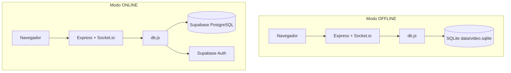
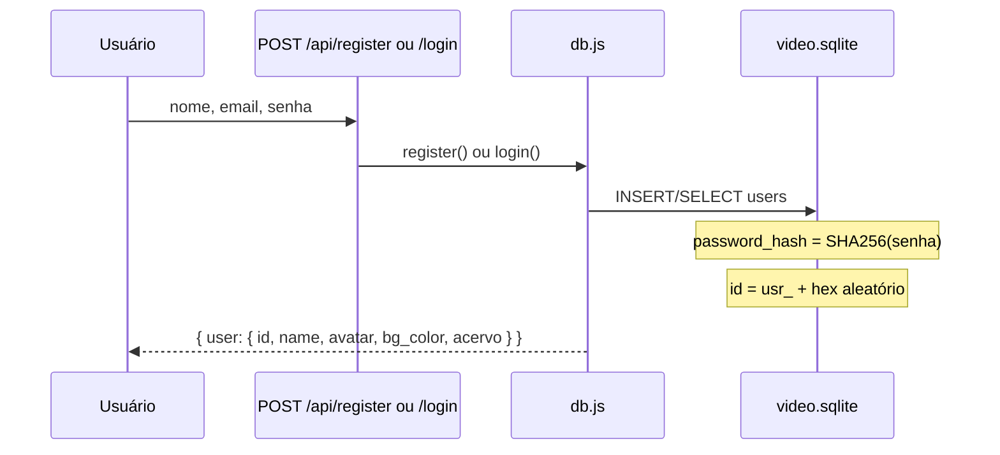
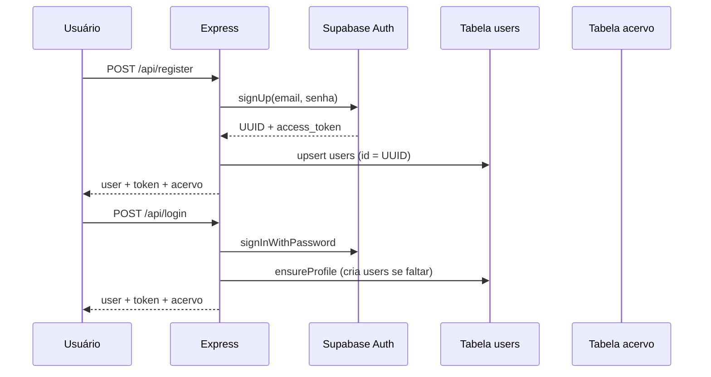

# Cinema das Guria — Documentação técnica

Guia completo: diferença entre **offline** e **online**, como o sistema funciona em cada modo, banco de dados, autenticação e deploy.

---

## Índice

1. [Visão geral dos dois modos](#visão-geral-dos-dois-modos)
2. [Como o backend escolhe o modo](#como-o-backend-escolhe-o-modo)
3. [Modo offline — funcionamento](#modo-offline--funcionamento)
4. [Modo online — funcionamento](#modo-online--funcionamento)
5. [Tabela comparativa completa](#tabela-comparativa-completa)
6. [Persistência de dados por usuário](#persistência-de-dados-por-usuário)
7. [Sala ao vivo (igual nos dois modos)](#sala-ao-vivo-igual-nos-dois-modos)
8. [API REST](#api-rest)
9. [Banco de dados e SQL](#banco-de-dados-e-sql)
10. [Rodar offline passo a passo](#rodar-offline-passo-a-passo)
11. [Rodar online localmente](#rodar-online-localmente)
12. [Deploy online (Render + Supabase)](#deploy-online-render--supabase)
13. [Estrutura do código](#estrutura-do-código)
14. [Problemas comuns](#problemas-comuns)

---

## Visão geral dos dois modos



| Camada | Offline | Online |
|--------|---------|--------|
| Interface | `public/` + `app.js` | Igual |
| Tempo real | Socket.io (`socket-game.js`) | Igual |
| Estado da partida | Memória (`game-state.js`) | Igual |
| Contas, perfil, acervo | **SQLite** | **Supabase** + **Auth** |

Ou seja: a **experiência na sala é a mesma**; só muda **onde** login, foto, cor e acervo são salvos.

---

## Como o backend escolhe o modo

Arquivo: `src/config.js`

```text
isOnline = (APP_MODE === 'online') E (SUPABASE_URL e SUPABASE_ANON_KEY preenchidos)
```

| Situação | Resultado |
|----------|-----------|
| `APP_MODE=offline` | Sempre **offline**, mesmo com chaves Supabase no `.env` |
| `APP_MODE=online` + chaves OK | **Online** |
| `APP_MODE=online` + sem chaves | **Offline** (fallback automático) |

O frontend descobre o modo em **`GET /env.js`**:

```javascript
window.ENV = { APP_MODE: "offline" | "online" };
```

- **Online:** APIs usam `Authorization: Bearer <token>`.
- **Offline:** APIs usam `user_id` na query ou no body (além do cookie de sessão no `localStorage`).

---

## Modo offline — funcionamento

### Para que serve

- Testar tudo na máquina **sem** Supabase e **sem** deploy.
- Desenvolver features com banco em um único arquivo.
- Demonstrações locais sem criar conta na nuvem.

### O que você precisa

- Node.js instalado.
- `.env` com `APP_MODE=offline`.
- **Sem** variáveis `SUPABASE_*` (ou deixe vazias).

### Fluxo de cadastro e login



1. **Registro:** cria linha em `users` com `id` tipo `usr_abc123`, e-mail único e `password_hash`.
2. **Login:** compara e-mail + hash da senha no SQLite.
3. **Sessão no navegador:** `localStorage` (`cinema_das_guria_user`) guarda `id`, nome, avatar, cor, acervo.
4. **APIs protegidas:** enviam `user_id` (ex.: `GET /api/profile?user_id=usr_xxx`).

### Onde ficam os dados

| Dado | Arquivo / tabela |
|------|------------------|
| Usuários, senha, avatar, cor | `data/video.sqlite` → tabela `users` |
| Acervo de vídeos | mesma base → tabela `acervo` |
| Fila do cinema, chat, placar | **Só na memória do servidor** (reinicia ao parar o Node) |

### IDs e senhas (offline)

- **ID:** `usr_` + string aleatória (ex.: `usr_a1b2c3d4e5`).
- **Senha:** nunca em texto puro; `SHA256` na coluna `password_hash`.
- **Não há JWT;** confiança na API local via `user_id` (adequado só para dev local).

---

## Modo online — funcionamento

### Para que serve

- Produção no Render (ou outro host).
- Dados **persistentes na nuvem** (não somem ao redeploy do SQLite no Render).
- Login profissional via **Supabase Auth**.

### O que você precisa

- Projeto Supabase com `supabase/schema.sql` executado.
- `.env` ou variáveis no Render com `APP_MODE=online` e as três chaves Supabase.
- **`SUPABASE_SERVICE_ROLE_KEY`** no servidor (backend grava perfil/acervo sem depender de RLS).

### Fluxo de cadastro e login



1. **Auth (nuvem):** e-mail e senha ficam no painel **Authentication** do Supabase.
2. **Perfil (tabela `users`):** `id` = **mesmo UUID** do Auth; nome, avatar, `bg_color`, e-mail.
3. **Token JWT:** devolvido no login; o front envia em `Authorization: Bearer ...`.
4. **Perfil inexistente:** no primeiro login, `db.ensureProfile()` cria a linha em `users` automaticamente (evita erro “perfil não encontrado”).

### Onde ficam os dados

| Dado | Onde |
|------|------|
| E-mail e senha | Supabase **Authentication** |
| Nome, avatar, cor de fundo | Tabela **`users`** |
| Acervo | Tabela **`acervo`** (`user_id` = UUID) |
| Fila, chat, votação | Memória do processo Node (igual offline) |

### IDs (online)

- **ID:** UUID do Supabase (ex.: `550e8400-e29b-41d4-a716-446655440000`).
- Contas offline antigas (`usr_...`) **não** são compatíveis com o banco online sem novo cadastro.

---

## Tabela comparativa completa

| Tópico | Offline | Online |
|--------|---------|--------|
| `APP_MODE` | `offline` | `online` |
| Arquivo `.env` exemplo | `.env.offline.exemple` | `.env.exemple` |
| Banco | `data/video.sqlite` | Supabase PostgreSQL |
| SQL de setup | `src/setup.js` (automático) | `supabase/schema.sql` (manual no painel) |
| Autenticação HTTP | `user_id` | JWT Bearer |
| Registro | `POST /api/register` → SQLite | `signUp` + insert `users` |
| Login | e-mail + hash local | `signInWithPassword` + token |
| `password_hash` em `users` | Sim (SHA256) | Não usado (Auth cuida da senha) |
| Coluna `users.id` | `usr_*` | UUID Auth |
| Perfil após logout | Lê SQLite no próximo login | Lê Supabase no próximo login |
| Acervo | SQLite `acervo` | Supabase `acervo` |
| Socket `join` | Valida `users.id` no SQLite | Valida JWT + perfil no Supabase |
| Deploy Render sem volume | SQLite **some** no redeploy | Dados **permanecem** |
| Internet obrigatória | Não | Sim (Supabase) |
| Giphy | Opcional (`GIPHY_API_KEY`) | Opcional |

---

## Persistência de dados por usuário

Cada conta tem **um objeto de usuário** no banco:

```json
{
  "id": "...",
  "name": "...",
  "email": "...",
  "avatar": "emoji ou data:image/... ou URL",
  "bg_color": "#0a0a0c",
  "acervo": [ { "url", "title", "thumbnail", ... } ]
}
```

| Ação | Offline | Online |
|------|---------|--------|
| Mudar foto / cor | `PUT /api/profile` → SQLite | `PUT /api/profile` → upsert `users` |
| Salvar vídeo no acervo | `POST /api/acervo` → SQLite | `POST /api/acervo` → Supabase |
| Trocar de conta | Outro `id` → outro registro | Outro UUID → outro registro |
| Logout + login | Recarrega do SQLite | Recarrega do Supabase (`GET /api/profile`) |

**Importante:** cor de fundo e avatar **não** devem ficar em chaves globais do `localStorage` soltas; tudo fica dentro de `cinema_das_guria_user` por conta.

Camada única no código: **`src/db.js`** (funções `register`, `login`, `loadFullUser`, `updateProfile`, `listAcervo`, etc.).

---

## Sala ao vivo (igual nos dois modos)

Independente de offline/online:

| Recurso | Implementação |
|---------|----------------|
| Estados | `LOBBY` → `PLAYING` → `VOTING` → `PODIUM` |
| Host | Primeiro conectado; passa ao desconectar |
| Fila | Até 5 vídeos por pessoa, máx. 15 na sala |
| Modos | `PALPITAR` (votação) / `ASSISTIR` (só fila) |
| Chat | Socket `sendMessage` (histórico em memória, máx. 50) |
| Perfil na sala | Nome/avatar/cor vêm do **banco** no evento `join` |

Arquivo: `src/socket-game.js` + `src/game-state.js`.

---

## API REST

Base: `http://localhost:PORT` (padrão **3002**).

| Método | Rota | Offline | Online |
|--------|------|---------|--------|
| POST | `/api/register` | body: `name, email, password, avatar?` | Igual |
| POST | `/api/login` | body: `email, password` | Igual; resposta inclui `token` |
| GET | `/api/profile` | `?user_id=` | Header `Authorization: Bearer` |
| PUT | `/api/profile` | body + `user_id` | body + Bearer |
| GET | `/api/acervo` | `?user_id=` | Bearer |
| POST | `/api/acervo` | `{ user_id, url }` | `{ url }` + Bearer |
| DELETE | `/api/acervo` | `{ user_id, url }` | `{ url }` + Bearer |
| GET | `/api/gifs?q=` | Público | Público |
| GET | `/env.js` | `APP_MODE` para o front | Igual |

Resposta padrão de sucesso com usuário:

```json
{
  "success": true,
  "user": {
    "id": "...",
    "name": "...",
    "email": "...",
    "avatar": null,
    "bg_color": "#0a0a0c",
    "token": null,
    "acervo": []
  }
}
```

---

## Banco de dados e SQL

### Offline (SQLite)

Criado automaticamente em `data/video.sqlite` ao subir o servidor (`src/setup.js`).

Tabelas: `users`, `acervo` (com `password_hash` no offline).

Reset manual:

```bash
npm run db:reset
```

### Online (Supabase)

Arquivo oficial: **`supabase/schema.sql`**

Cole **inteiro** no SQL Editor do Supabase. Ele:

- Remove `users` e `acervo` antigos (`DROP ... CASCADE`).
- Recria tabelas alinhadas ao código.
- Desliga RLS (o backend usa `SERVICE_ROLE_KEY`).
- Cria índice e trigger de `updated_at` em `users`.

**Não** inclui `rooms` nem `history` — o app não usa essas tabelas na nuvem.

### RLS ligado ou desligado?

| Abordagem | Quando faz sentido |
|-----------|-------------------|
| **RLS desligado** (`DISABLE ROW LEVEL SECURITY`) | **Este projeto.** Só o servidor Node grava nas tabelas; o front chama `/api/*`. Simples e sem erro no login. |
| **RLS ligado + políticas** | App mobile/web que usa Supabase **direto do navegador** com anon key. |
| **RLS ligado + SERVICE_ROLE no servidor** | Também funciona, mas é redundante: a service role **já ignora** RLS. |

No painel: **Table Editor → `users` → desligar "Enable Row Level Security"** = mesmo que `supabase/fix-rls.sql`.

```sql
-- Resumo (ver arquivo completo em supabase/schema.sql)
users:  id, name, email, avatar, bg_color, created_at, updated_at
acervo: id, user_id → users(id), url, title, thumbnail, created_at
        UNIQUE (user_id, url)
```

---

## Rodar offline passo a passo

1. Clone e instale:
   ```bash
   cd video
   npm install
   ```

2. Ambiente:
   ```bash
   copy .env.offline.exemple .env
   ```
   Conteúdo mínimo:
   ```env
   APP_MODE=offline
   PORT=3002
   ```

3. SQLite (se der erro de módulo nativo):
   ```bash
   npm rebuild better-sqlite3
   ```

4. Subir:
   ```bash
   npm run dev
   ```

5. Acesse `http://localhost:3002`, cadastre-se, teste perfil e acervo.

6. Confirme o modo no terminal:
   ```text
   (offline / SQLite)
   Banco local: ...\data\video.sqlite
   ```

---

## Rodar online localmente

Útil para testar integração Supabase **antes** do Render.

1. Execute `supabase/schema.sql` no projeto Supabase.
2. Configure `.env`:
   ```env
   APP_MODE=online
   PORT=3002
   SUPABASE_URL=https://SEU_PROJETO.supabase.co
   SUPABASE_ANON_KEY=eyJ...
   SUPABASE_SERVICE_ROLE_KEY=eyJ...
   ```
3. `npm start` → `http://localhost:3002`
4. Terminal deve mostrar: `(online / Supabase)`.

Authentication → desative “Confirm email” se quiser login imediato após registro.

---

## Deploy online (Render + Supabase)

### Supabase

1. Novo projeto → SQL Editor → colar `supabase/schema.sql` → Run.
2. Authentication → Email ativo.
3. Settings → API → copiar URL, `anon`, `service_role`.

### Render

| Campo | Valor |
|-------|--------|
| Build | `npm install` |
| Start | `npm start` |
| `APP_MODE` | `online` |
| `PORT` | `10000` (ou o que o Render definir) |
| `SUPABASE_URL` | Project URL |
| `SUPABASE_ANON_KEY` | anon public |
| `SUPABASE_SERVICE_ROLE_KEY` | service_role (**secreto**) |

**Não** use modo offline no Render: o disco efêmero apaga o SQLite a cada deploy.

### Checklist pós-deploy

- [ ] Login e registro funcionam
- [ ] Salvar cor de perfil sem erro 404
- [ ] Acervo persiste após logout
- [ ] Segunda conta vê **seus** dados, não os da primeira

---

## Estrutura do código

```
video/
├── supabase/
│   └── schema.sql          # SQL único (online)
├── data/
│   └── video.sqlite        # Gerado no offline
├── public/
│   ├── index.html
│   └── js/app.js           # UI + sessão + chamadas API
└── src/
    ├── index.js            # Express + Socket.io
    ├── config.js           # offline vs online
    ├── db.js               # Persistência (users + acervo)
    ├── routes.js           # REST
    ├── socket-game.js      # Sala em tempo real
    ├── game-state.js       # Estado LOBBY/PLAYING/...
    ├── video-utils.js      # YouTube/TikTok/URLs
    └── setup.js            # Schema SQLite + db:reset
```

**Regra:** qualquer leitura/gravação de perfil ou acervo passa por **`db.js`**. Não duplique lógica Supabase/SQLite em outros arquivos.

---

## Problemas comuns

| Sintoma | Causa provável | Solução |
|---------|----------------|---------|
| `SQLite não iniciou` | `better-sqlite3` compilado para outra versão do Node | `npm rebuild better-sqlite3` |
| Ainda conecta no Supabase em “offline” | `.env` com `APP_MODE=online` ou chaves preenchidas | Use `.env.offline.exemple` |
| Perfil não encontrado (online) | Linha em `users` ausente | Login de novo; `ensureProfile` cria; confira `SERVICE_ROLE_KEY` |
| `new row violates row-level security policy for table "users"` | RLS ligado no Supabase e servidor sem `SERVICE_ROLE_KEY` | Rode `supabase/fix-rls.sql` e adicione `SUPABASE_SERVICE_ROLE_KEY` no Render |
| Dados somem no Render | Deploy em modo offline (SQLite) | `APP_MODE=online` + Supabase |
| Acervo de outro usuário | Sessão/`user_id` errado no front | Logout limpo; login na conta certa |
| `EXECUTE FUNCTION` falha no SQL | Versão PostgreSQL | Troque por `EXECUTE PROCEDURE` no trigger |

---

## Resumo em uma frase

- **Offline:** tudo na sua máquina, arquivo `video.sqlite`, ideal para **testar**.
- **Online:** Auth + tabelas no Supabase, ideal para **produção**; mesma interface e mesma sala, outro lugar para guardar conta e acervo.
